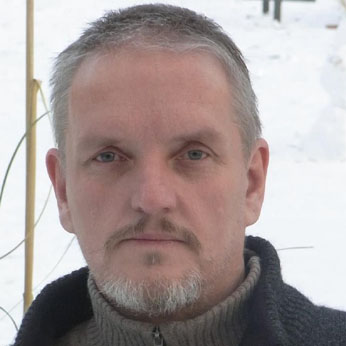

# Afterwords
I am happy that you have read so far. 
I hope this book could help you to learn some more possibilities as a software developer. 
I wish you good luck on your way. 
If you like this book then I would appreciate when you could write a small review to help other people to also find this book.
# About The Author
  

Olaf Art Ananda, born 1963 in Hamburg, Germany has been a software developer for over 30 years now. He started with C, learned Assembler to speed up C programs and after trying out most popular programming languages like Java, C# and Objective-C he came back to C/C++ and started to develop desktop appĺications using Qt5 in 2016.
Qt5 was the ideal platform for him to express his skills he has learned studying Human Computer Interaction Design in 2013. After a first try to use Python to develop plug-ins for his programs he needed another two years to really get to know Python. Today he enjoys the simplicity of this language to write apps in a very short time compared to C++.
Olaf has worked for several top 500 companies like Dupont, Dresdner Bank, Commerzbank and Zürcher Kantonalbank to name a few.
After his burnout and a near death experience he decided to quit working for profit. 
Since 2016 he is writing open source software like the AnimationMaker, the FlatSiteBuilder and the EbookCreator.
He also has written a book about his life and Tantra.
Since 2016 he is living in his mobile home in the middle of Berlin and he is also playing percussion on the streets.
To write code he is going to a public library.
That's an easy living.