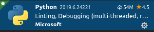
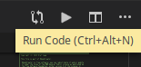
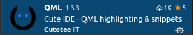
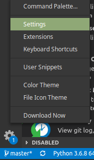
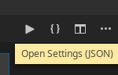
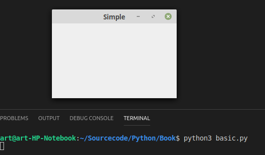

#Part I - Prolog

##Installation

Here we are going to install all necessary software to be able to write code and test it at least on the desktop. 
To be able to also deploy the app to other devices we will install additional software in the deployment chapter later in this book. 

I assume that you already have installed Python3 and Pip. If not you should find all necessary information on the [Python](https://python.org) website. We need version 3.7.   
I also assume that you able to install software using pip. 

First we will install [PyQt5](https://www.riverbankcomputing.com/software/pyqt/intro) which comes together with Qt5 to be able to code applications for the desktop. 

```console
user@machine:/path$ pip3 install PyQt5
user@machine:/path$ pip3 install PyQtWebEngine
```

Then we will install [Visual Studio Code](https://code.visualstudio.com/) which is free and open source and has many good extensions to develop Python code. 
You can download VSCode [here](https://code.visualstudio.com/Download). I assume that you are able to install VSCode on your own. Otherwise you will find installation instructions on this website. 
You can also use apt if you are on a Linux system. 
Use google search if there are some prerequisites missing. 

```console
user@machine:/path$sudo add-apt-repository "deb [arch=amd64] https://packages.microsoft.com/repos/vscode stable main"
user@machine:/path$ sudo apt update
user@machine:/path$ sudo apt install code
```

In the next chapter we will setup the environment to be able to write our first app. 

##Development Environment Setup

After installing VSCode you should install some nifty extensions like these.   

###Python

Python is a syntax hiliter, debugger and linter. Sometimes it also shows you the correct intellisense.   


###Coderunner

With coderunner you are able to start your app with just on click.     

You just have to click the "Play" button.   


###QML

QML is useful to syntax hilite QML code.   


###VSCode Settings

You can open the settings file using this menu.   
   
And then click <strong>"{}"</strong> on upper right site of the screen to open the json file.   
   
Here are some useful setting which I have entered into the <em>settings.json</em>.  

<div class="codehilite"><pre><span></span><code><span class="p">{</span>
    <span class="nt">&quot;workbench.colorTheme&quot;</span><span class="p">:</span> <span class="s2">&quot;Visual Studio Dark&quot;</span><span class="p">,</span>
    <span class="nt">&quot;code-runner.executorMap&quot;</span><span class="p">:</span> <span class="p">{</span>
        <span class="nt">&quot;python&quot;</span><span class="p">:</span> <span class="s2">&quot;python3 $workspaceRoot/main.py&quot;</span><span class="p">,</span>
    <span class="p">},</span>
    <span class="nt">&quot;code-runner.clearPreviousOutput&quot;</span><span class="p">:</span> <span class="kc">true</span><span class="p">,</span>
    <span class="nt">&quot;code-runner.saveAllFilesBeforeRun&quot;</span><span class="p">:</span> <span class="kc">true</span><span class="p">,</span>
    <span class="nt">&quot;git.autofetch&quot;</span><span class="p">:</span> <span class="kc">true</span><span class="p">,</span>
<span class="p">}</span>
</code></pre></div>

##First App

To test the environment we now create a simple app.  

*basic.py*
```python
import sys
from PyQt5.QtWidgets import QApplication, QWidget


app = QApplication(sys.argv)
w = QWidget()
w.resize(250, 150)
w.setWindowTitle('Simple')
w.show()
app.exec()
```
In this case, because the python file is not named *main.py* we will run it using the terminal inside of VSCode.  

```console
user@machine:/path$ python3 basic.py
```

  
  
Here we create an app, instantiate a widget, set the widgets size, set a window title, make the widget visible and execute the main loop.   
In this main loop the app is polling for events like mouse and keyboard send them to the window and the window is reacting on them. In this case it will only react on resize, move and the close event when the user clicks the green close button on the upper right corner of the window where the main loop is exited.  

##Summary

After setting up the development environment we now have created our first Qt app at least for the desktop.
