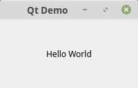
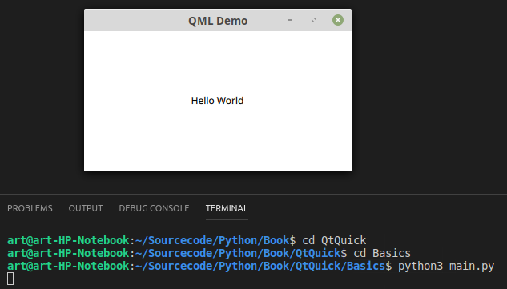
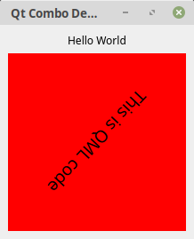

#Part II - Basics

##Many Different Approaches

Because of the fact that Python has been introduced in 1991, meanwhile there are a few user interface approaches to develop Python applications.
There is Tkinter which is a bridge to TK. Tkinter is been delivered with Python. 
There is Kivy which has got a nice approach using a special pythonic language to declare the user interface. 
There is BeeWare which compiles Python to Java-ByteCode which then can be deployed on an Android device. 
There is Enaml Native which act like Pythons answer to React Native and there are a few approaches to bridge to Qt. Qt is pronounced 'Cute'. 
These approaches are PySide, which bridges to Qt4. 
There is PyQt which also bridges to Qt4, PySide2 which bridges to Qt5 and last but not least PyQt5 which we are talking about in this book. 
I am not going to talk about the pros and cons of all these possibilities in this book. Instead I am focusing on solutions. 
To use PyQt5 is a personal decision after working a few years with Qt5. 
Qt5 and PyQt5 are available under an open source license so you might use these frameworks for free as long as you plan to create open source programs. If you are going to create commercial software you have to purchase licenses for both frameworks. 
Even when we are using Qt5 we have got two options to develop applications. 
First option is QtWidgets which has been introduced to create platform independent desktops applications and QtQuick which uses a declarative way to implement user interfaces using QML (Qt Markup Language). 
Because at the moment QtQuick lacks of a tree view and a table view implementation I guess it has been primarily developed to satisfy mobile app development. 
QtQuick has also implemented behaviours and transitions which you normally only see on mobile platforms. 
If you have got design background then the QML approach could be your best choice because you don't really have to write code that much and when you like to write imperative code then QtWidgets might be your way. 

##Hello World (QtWidgets)

Now I will show you how a very basic QtWidgets app will look like.   

*QWidget/Basics/main.py*  
```python
import sys
from PyQt5.QtWidgets import QApplication, QMainWindow, QLabel
from PyQt5.QtCore import Qt


class MainWindow(QMainWindow):
    def __init__(self):
        QMainWindow.__init__(self)
        self.setWindowTitle("Qt Demo")
        label = QLabel("Hello World")
        label.setAlignment(Qt.AlignCenter)
        self.setCentralWidget(label)

if __name__ == "__main__":
    app = QApplication(sys.argv)
    win = MainWindow()
    win.show()
    sys.exit(app.exec())
```



The sample is simply self explanatory. We are creating an application object. Instantiate a window. Make the window visible and execute the app main loop.   
In the window there is just a label widget which will be set as the central widget.   
In bigger projects it would be better to create a python file for each class so that the class MainWindow will become an own file called *mainwindow.py*.

##Hello World (QtQuick)

The hello world app for the QtQuick part will be made out of two file. First the main.py where the qml file will be loaded and the main loop will be started and a second file named view.qml where the user interface is been declared.

*QtQuick/Basics/main.py*
```python
import sys
from PyQt5.QtGui import QGuiApplication
from PyQt5.QtQml import QQmlApplicationEngine


if __name__ == "__main__":
    app = QGuiApplication(sys.argv)
    engine = QQmlApplicationEngine("view.qml")
    if not engine.rootObjects():
        sys.exit(-1)
    sys.exit(app.exec())
```

*QtQuick/Basics/view.qml*
```qml
import QtQuick 2.0
import QtQuick.Controls 2.5

ApplicationWindow {
    visible: true

    Text {
        anchors.horizontalCenter: parent.horizontalCenter
        anchors.verticalCenter: parent.verticalCenter
        text: "Hello World"
    }
}
```
In order to start the app we have to cd into the Basics directory and start it like this:  

```console
user@machine:/path$ python3 main.py
```

  

This app is similar to the QtWidgets version except the fact that we use a QGuiApplication instead of a QApplication. And also a QQmlApplicationEngine is responsible to load the user interface.

##Combining QWidget and QML
A third possibility is to combine both QWidget and QML using the QQuickView inside a QWidget application.  

*Combo/main.py*
```python
import sys
from PyQt5.QtWidgets import QApplication, QMainWindow, QLabel, QVBoxLayout, QWidget
from PyQt5.QtCore import Qt, QUrl
from PyQt5.QtQuick import QQuickView


class MainWindow(QMainWindow):
    def __init__(self):
        QMainWindow.__init__(self)
        self.setWindowTitle("Qt Combo Demo")
        widget= QWidget()
        layout = QVBoxLayout()
        view = QQuickView()
        container = QWidget.createWindowContainer(view, self)
        container.setMinimumSize(200, 200)
        container.setMaximumSize(200, 200)
        view.setSource(QUrl("view.qml"))
        label = QLabel("Hello World")
        label.setAlignment(Qt.AlignCenter)
        layout.addWidget(label)
        layout.addWidget(container)
        widget.setLayout(layout)
        self.setCentralWidget(widget)
        

if __name__ == "__main__":
    app = QApplication(sys.argv)
    win = MainWindow()
    win.show()
    sys.exit(app.exec())
```

*Combo/view.qml*  
```qml
import QtQuick 2.1

Rectangle {
    id: rectangle
    color: "red"
    width: 200
    height: 200

    Text {
        id: text
        text: "This is QML code"
        font.pointSize: 14
        anchors.centerIn: parent
        PropertyAnimation {
            id: animation
            target: text
            property: "rotation"
            from: 0; to: 360; duration: 5000
            loops: Animation.Infinite
        }
    }
    MouseArea {
        anchors.fill: parent
        onClicked: animation.paused ? animation.resume() : animation.pause()
    }
    Component.onCompleted: animation.start()
}
```
  

Be aware that you should not use many QQuickViews inside a QWidget window because of performance issues.

##Summary
We have seen three approaches to build GUI applications using Qt5. The QWidgets approach is mostly used to create desktop applications. The QML approach is mostly used to create mobile applications and the combination can be used to create desktop applications where we use QML to render a part of thes desktop experience.
