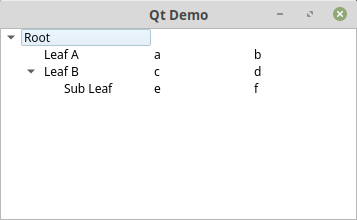
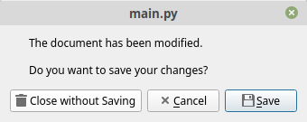
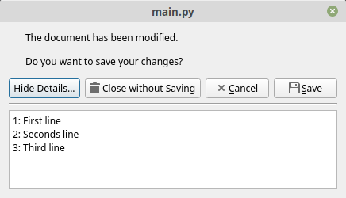

# Part III QtWidgets
## Base Widgets and Layouts
Now we will use the most used basic widgets in a small desktop application to give you a first overview of widgets and layouts.  
For more details on each widget I invite you to search on the internet.
A good starting point is this webpage: [https://doc.qt.io/qt-5/classes.html](https://doc.qt.io/qt-5/classes.html)  
On this webpage you often see samples which are written in C++, but you might be able to translate them to Python easily.  
Here are some examples:  
```cpp
QPushButton *button = new QPushButton("&Download", this);
```  
Because C++ is strong typed the variable button is declared here as a pointer to QPushButton.
The "*" indicates that button is a pointer. The new keyword creates a new instance of QPushButton and this is a pointer to the containing window.
In Python we transform this to:
```python
button = QPushButton("&Download", self)
```
If you see code like this:
```cpp
findDialog->show();
```
This means findDialog is a pointer to a dialog instance and via the "->" operator the show method is called.
We translate this to:
```python
findDialog.show()
```
Sometimes in C++ objects are declared like this (without the * in front of the variable and the new keyword in front of the class name). Also the operator to call method has changed to "." instead of "->".
```cpp
QFileDialog dialog(this);
dialog.setFileMode(QFileDialog::AnyFile);
```
This means the variable dialog of type QFileDialog has been declared and initialized with "this" (the containing window).
In Python we will code it like this:
```python
dialog = QFileDialog(self)
dialog.setFileMode(QFileDialog.AnyFile)
```
In Python we make no difference between objects and pointers. Also notice that instead of the "::" enum operator in Python we just use a dot "." to access a enumeration field.  

But now it's time for an example.  

*QWidget/BaseWidgets/main.py*
```python
import sys
from PyQt5.QtWidgets import (QApplication, QMainWindow, QLabel, QWidget, QGridLayout, 
                             QLineEdit, QVBoxLayout, QHBoxLayout, QPushButton, QGroupBox, 
                             QRadioButton, QCheckBox, QComboBox)
from PyQt5.QtCore import Qt


class MainWindow(QMainWindow):
    def __init__(self):
        QMainWindow.__init__(self)
        self.setWindowTitle("Qt Demo")
        widget = QWidget()
        layout = QGridLayout()
        hbox = QHBoxLayout()
        vbox = QVBoxLayout()
        self.name_edit = QLineEdit()
        self.name_edit.setPlaceholderText("Enter your full name here")
        self.name_edit.setMinimumWidth(200)
        self.email_edit = QLineEdit()
        self.email_edit.setPlaceholderText("Enter a valid email address here")
        group = QGroupBox("Select category")
        group.setLayout(vbox)
        self.free = QRadioButton("Free")
        self.premium = QRadioButton("Premium")
        self.enterprise = QRadioButton("Enterprise")
        vbox.addWidget(self.free)
        vbox.addWidget(self.premium)
        vbox.addWidget(self.enterprise)
        self.cb = QCheckBox("Send me an invoice")
        self.combo = QComboBox()
        self.combo.addItem("5 GB")
        self.combo.addItem("10 GB")
        self.combo.addItem("20 GB")
        self.combo.addItem("50 GB")
        self.combo.addItem("100 GB")
        ok_button = QPushButton("Ok")
        cancel_button = QPushButton("Cancel")
        hbox.addStretch()
        hbox.addWidget(ok_button)
        hbox.addWidget(cancel_button)
        layout.addWidget(QLabel("Name:"), 0, 0)
        layout.addWidget(self.name_edit, 0, 1)
        layout.addWidget(QLabel("Email:"), 1, 0)
        layout.addWidget(self.email_edit, 1, 1)
        layout.addWidget(QLabel("Data volume"), 2, 0)
        layout.addWidget(self.combo, 2, 1)
        layout.addWidget(self.cb, 3, 0, 1, 2)
        layout.addWidget(group, 4, 0, 1, 2)
        layout.addLayout(hbox, 5, 0, 1, 2)
        widget.setLayout(layout)
        self.setCentralWidget(widget)

        ok_button.clicked.connect(self.okClicked)

    def okClicked(self):
        name = self.name_edit.text()
        email = self.email_edit.text()
        data_volume = self.combo.currentText()
        send_invoice = self.cb.checkState() == Qt.Checked
        if self.free.isChecked():
            category = "Free"
        elif self.premium.isChecked():
            category = "Premium"
        elif self.enterprise.isChecked():
            category = "Enterprise"
        else:
            category = "None"

        print("name:", name)
        print("email:", email)
        print("data:", data_volume)
        print("invoice:", send_invoice)
        print("category:", category)

if __name__ == "__main__":
    app = QApplication(sys.argv)
    win = MainWindow()
    win.show()
    sys.exit(app.exec())
```


###Layout
In this sample we have got the window and inside this window we use a simple QWidget as central widget for the purpose to set the layout of this widget to QGridView. A QGridView arranges all widgets in a row and column fashion. The column count will be emerged depending on the usage of the grid. If you are for example adding a widget with ```layout.addWidget(widget, 0, 1)
``` then a widget at row 0 and column 1 will be added. This leads to a column count of 2. If you also define a row- and column span to this method like ```layout.addWidget(widget, 0, 1, 1, 4)  
``` then the the column count will be set to 5.  
Inside this QGridLayout we use two other layouts. The QVBoxLayout arranges widgets in a vertical direction and the QHBoxLayout lays out widget horizontally. In the case of the ```hbox
``` we are using a stretch object to align the buttons to the right side.  
To set the window width we use this little trick:
```
self.name_edit.setMinimumWidth(200)
```
We are just setting the minimum width of the second column to 200 pixel and all other columns will be rendered in the same size. 
###Signals and Slots
Signals and slots are a Qt specific method to create a publisher/subscriber pattern. In our case the QPushButton fires a signal when the button is clicked and the containing widget can connect this signal to a slot. In this case the method okClicked is the slot which will be called each time the button fires a clicked Signal. The signal will be connected with the following syntax:
```python
ok_button.clicked.connect(self.okClicked)
```
If you see C++ samples they might look like this:
```cpp
connect(m_button, SIGNAL (released()), this, SLOT (handleButton()));
```
And they will be translated like this:
```python
m_button.released.connect(self.handleButton)
```
## ListView
Some widgets like the QListView are working with a data model. Here is an example.

*QWidget/ListView/main.py*
```python
import sys
from PyQt5.QtWidgets import QApplication, QMainWindow, QListView
from PyQt5.QtCore import Qt
from PyQt5.QtGui import QStandardItem, QStandardItemModel


class MainWindow(QMainWindow):
    def __init__(self):
        QMainWindow.__init__(self)
        self.setWindowTitle("Qt Demo")
        list = QListView()
        self.model = QStandardItemModel(list)
        cars = [
            'Jaguar',
            'Porsche',
            'Mercedes',
            'Jeep',
            'Toyota'
        ]
 
        for car in cars:
            item = QStandardItem(car)
            item.setCheckable(True)
            self.model.appendRow(item)
 
        list.setModel(self.model)
        self.setCentralWidget(list)

        self.model.itemChanged.connect(self.onItemChanged)

    def onItemChanged(self, item):
        if not item.checkState():
            print(item.text() + " has been unchecked")
        else:
            print(item.text() + " has been checked")
        

if __name__ == "__main__":
    app = QApplication(sys.argv)
    win = MainWindow()
    win.show()
    sys.exit(app.exec_())
```


In this example we use the QStandardItemModel with QStandardItem's for each list item. Just simple.
In the next chapter we will create our own data model.
## TreeWidget
For this tree view example we use our own data model which extends the QAbstractItemModel.


*QWidget/TreeView/treemodel.py*
```python
from PyQt5.QtCore import QAbstractItemModel, Qt, QModelIndex


class TreeModel(QAbstractItemModel):
    def __init__(self, in_nodes):
        QAbstractItemModel.__init__(self)
        self._root = TreeNode(None)
        for node in in_nodes:
            self._root.addChild(node)

    def rowCount(self, in_index):
        if in_index.isValid():
            return in_index.internalPointer().childCount()
        return self._root.childCount()
      
    def addChild(self, in_node, in_parent):
        if not in_parent or not in_parent.isValid():
            parent = self._root
        else:
            parent = in_parent.internalPointer()
        parent.addChild(in_node)

    def index(self, in_row, in_column, in_parent=None):
        if not in_parent or not in_parent.isValid():
            parent = self._root
        else:
            parent = in_parent.internalPointer()
  
        if not QAbstractItemModel.hasIndex(self, in_row, in_column, in_parent):
            return QtCore.QModelIndex()
  
        child = parent.child(in_row)
        if child:
            return QAbstractItemModel.createIndex(self, in_row, in_column, child)
        else:
            return QModelIndex()

    def parent(self, in_index):  
        if in_index.isValid():  
            p = in_index.internalPointer().parent()  
            if p:  
                return QAbstractItemModel.createIndex(self, p.row(),0,p)  
        return QModelIndex()  
      
    def columnCount(self, in_index):
        if in_index.isValid():
            return in_index.internalPointer().columnCount()
        return self._root.columnCount()
      
    def data(self, in_index, role):
        if not in_index.isValid():
            return None
        node = in_index.internalPointer()
        if role == Qt.DisplayRole:
            return node.data(in_index.column())
        return None
    

class TreeNode(object):
    def __init__(self, in_data):
        self._data = in_data
        if type(in_data) == tuple:
            self._data = list(in_data)
        if type(in_data) is str or not hasattr(in_data, '__getitem__'):
            self._data = [in_data]
      
        self._columncount = len(self._data)
        self._children = []
        self._parent = None
        self._row = 0
    
    def data(self, in_column):
        if in_column >= 0 and in_column < len(self._data):
            return self._data[in_column]

    def columnCount(self):
        return self._columncount

    def childCount(self):
        return len(self._children)

    def child(self, in_row):
        if in_row >= 0 and in_row < self.childCount():
            return self._children[in_row]

    def parent(self):
        return self._parent

    def row(self):
        return self._row

    def addChild(self, in_child):
        in_child._parent = self
        in_child._row = len(self._children)
        self._children.append(in_child)
        self._columncount = max(in_child.columnCount(), self._columncount)
```  

When subclassing QAbstractItemModel, at the very least you must implement index(), parent(), rowCount(), columnCount(), and data(). These functions are used in all read-only models, and form the basis of editable models.

*QWidget/TreeView/main.py*
```python
import sys
from PyQt5.QtWidgets import QApplication, QMainWindow, QTreeView
from PyQt5.QtCore import Qt
from treemodel import TreeModel, TreeNode


class MainWindow(QMainWindow):
    def __init__(self):
        QMainWindow.__init__(self)

        items = []
        items.append(TreeNode("Root"))
        items[0].addChild(TreeNode(["Leaf A", "a", "b"]))
        items[0].addChild(TreeNode(["Leaf B", "c", "d"]))
        items[0].child(1).addChild(TreeNode(["Sub Leaf", "e", "f"]))

        self.setWindowTitle("Qt Demo")
        tree = QTreeView()
        tree.setModel(TreeModel(items))
        tree.setHeaderHidden(True)
        tree.setColumnWidth(0, 150)
        self.setCentralWidget(tree)

if __name__ == "__main__":
    app = QApplication(sys.argv)
    win = MainWindow()
    win.show()
    sys.exit(app.exec_())
```

  
This is also a very basic example but it's a good start to see how to use treeviews at all.
## Dialog
If you prefer to create all your windows and dialogs using Qt-Creator which contains a user interface editor, then you can use the following technique. Open Qt-Creator and edit a dialog in design mode.
  

The created dialog will then be saved in a "*.ui" file an can be used in our code as follows.
```python
import sys
from PyQt5.QtWidgets import QApplication
from PyQt5.uic import loadUiType

UIClass, QtBaseClass = loadUiType("dialog.ui")

class MyApp(UIClass, QtBaseClass):
    def __init__(self):
        UIClass.__init__(self)
        QtBaseClass.__init__(self)
        self.setupUi(self)

if __name__ == "__main__":
    app = QApplication(sys.argv)
    window = MyApp()
    window.show()
    sys.exit(app.exec_())   
```

## MessageDialog
Here is a sample to show some possibilities to use a messagebox.  

*QWidget/MessageDialog/main.py*
```python
import sys
from PyQt5.QtWidgets import QApplication, QMainWindow, QLabel, QWidget, QVBoxLayout, QPushButton, QMessageBox
from PyQt5.QtCore import Qt


class MainWindow(QMainWindow):
    def __init__(self):
        QMainWindow.__init__(self)
        self.setWindowTitle("Qt Demo")
        widget = QWidget()
        layout = QVBoxLayout()
        simple = QPushButton("Simple")
        save = QPushButton("Save")
        details = QPushButton("Save with details")
        warning = QPushButton("Warning")
        layout.addWidget(simple)
        layout.addWidget(save)
        layout.addWidget(details)
        layout.addWidget(warning)
        widget.setLayout(layout)
        self.setCentralWidget(widget)

        simple.clicked.connect(self.simple)
        save.clicked.connect(self.save)
        details.clicked.connect(self.details)
        warning.clicked.connect(self.warning)

    def simple(self):
        msg = QMessageBox()
        msg.setText("This is a simple message.")
        msg.exec()

    def save(self):
        msg = QMessageBox()
        msg.setText("The document has been modified.")
        msg.setInformativeText("Do you want to save your changes?")
        msg.setStandardButtons(QMessageBox.Save | QMessageBox.Discard | QMessageBox.Cancel)
        msg.setDefaultButton(QMessageBox.Save)
        ret = msg.exec()

    def details(self):
        msg = QMessageBox()
        msg.setText("The document has been modified.")
        msg.setInformativeText("Do you want to save your changes?")
        msg.setStandardButtons(QMessageBox.Save | QMessageBox.Discard | QMessageBox.Cancel)
        msg.setDefaultButton(QMessageBox.Save)
        msg.setDetailedText("1: First line\n2: Seconds line\n3: Third line")
        ret = msg.exec()

    def warning(self):
        ret = QMessageBox.warning(self, "My Application", 
            "The document has been modified.\n Do you want to save your changes?", 
            QMessageBox.Save | QMessageBox.Discard | QMessageBox.Cancel, 
            QMessageBox.Save)

if __name__ == "__main__":
    app = QApplication(sys.argv)
    win = MainWindow()
    win.show()
    sys.exit(app.exec())
```
Keep in mind that it's not a good practise to use multiple message boxes in a row.  

  
  
  
  
 
Like we have got an icon in the warning dialog, we can also set the icon using the ```setIcon()``` method.  
We have got four icons to choose from:
```python
msg.setIcon(QMessageBox.Question)
msg.setIcon(QMessageBox.Information)
msg.setIcon(QMessageBox.Warning)
msg.setIcon(QMessageBox.Critical)
```

##User Defined Widgets
Sometimes you are missing a specific widget and if you are not able to download it somewhere, then you have to create it on your own.  
In the following example I will introduce a DockWidget, a ScrollArea and of course a user defined widget called Expander.  
I remember that I saw an expander in an email client on Windows for the first time.  
The usage is very simple. Just click on the rectangle an the content will expand. The content can be a list of menuitems, a text edit, a listbox or whatever.  

*QWidget/UserDefined/main.py*
```python
import sys
from PyQt5.QtWidgets import (QSizePolicy, QListWidget, QListWidgetItem, QApplication, QMainWindow, QLabel, 
			  QTextEdit, QVBoxLayout, QScrollArea, QDockWidget, QWidget)
from PyQt5.QtCore import Qt
from expander import Expander

class MainWindow(QMainWindow):
    def __init__(self):
        QMainWindow.__init__(self)
        self.setWindowTitle("Qt Expander Demo")
        self.resize(640, 480)

        edit = QTextEdit()
        edit.setPlainText("Lorem ipsum dolor...")
        self.content = Expander("Content", "parts.svg")
        self.images = Expander("Images", "images.svg")
        self.settings = Expander("Settings", "settings.svg")
        vbox = QVBoxLayout()
        vbox.addWidget(self.content)
        vbox.addWidget(self.images)
        vbox.addWidget(self.settings)
        vbox.addStretch()
        scroll_content = QWidget()
        scroll_content.setLayout(vbox)
        scroll = QScrollArea()
        scroll.setHorizontalScrollBarPolicy(Qt.ScrollBarAsNeeded)
        scroll.setVerticalScrollBarPolicy(Qt.ScrollBarAsNeeded)
        scroll.setWidget(scroll_content)
        scroll.setWidgetResizable(True)
        scroll.setMaximumWidth(200)
        scroll.setMinimumWidth(200)
        self.navigationdock = QDockWidget("Navigation", self)
        self.navigationdock.setAllowedAreas(Qt.LeftDockWidgetArea | Qt.RightDockWidgetArea)
        self.navigationdock.setWidget(scroll)
        self.navigationdock.setObjectName("Navigation")
        self.addDockWidget(Qt.LeftDockWidgetArea, self.navigationdock)
        self.setCentralWidget(edit)

        # fill content
        self.content_list = QListWidget()
        self.content_list.setSizePolicy(QSizePolicy.Ignored, QSizePolicy.Fixed)
        for i in range(5):
            item = QListWidgetItem()
            item.setText("Item " + str(i))
            self.content_list.addItem(item)
        content_box = QVBoxLayout()
        content_box.addWidget(self.content_list)
        self.content.addLayout(content_box)


        # fill images
        self.images_list = QListWidget()
        self.images_list.setSizePolicy(QSizePolicy.Ignored, QSizePolicy.Fixed)
        for i in range(5):
            item = QListWidgetItem()
            item.setText("Image " + str(i))
            self.images_list.addItem(item)
        images_box = QVBoxLayout()
        images_box.addWidget(self.images_list)
        self.images.addLayout(images_box)


        #fill settings
        self.settings_list = QListWidget()
        self.settings_list.setSizePolicy(QSizePolicy.Ignored, QSizePolicy.Fixed)
        for i in range(5):
            item = QListWidgetItem()
            item.setText("Setting " + str(i))
            self.settings_list.addItem(item)
        settings_box = QVBoxLayout()
        settings_box.addWidget(self.settings_list)
        self.settings.addLayout(settings_box)

        self.content.expanded.connect(self.contentExpanded)
        self.images.expanded.connect(self.imagesExpanded)
        self.settings.expanded.connect(self.settingsExpanded)

    def contentExpanded(self, value):
        if value:
            self.images.setExpanded(False)
            self.settings.setExpanded(False)

    def imagesExpanded(self, value):
        if value:
            self.content.setExpanded(False)
            self.settings.setExpanded(False)

    def settingsExpanded(self, value):
        if value:
            self.content.setExpanded(False)
            self.images.setExpanded(False)


if __name__ == "__main__":
    app = QApplication(sys.argv)
    win = MainWindow()
    win.show()
    sys.exit(app.exec())
```
The DockWidget can be placed anywhere on the window depending on the AllowedAreas.  
In this sample the DockWidget can be placed on the left and on the right side.  

The ScrollArea can contain widgets that are larger than the window itself. If its not possible to display the whole widget, then a scroll bar will be displayed which enables the user to scroll the content. In our sample the scroll bars will only be displayed if there is something to scroll (Qt.ScrollAsNeeded). If the widget fits into the scroll area no scroll bars will be displayed.  

*QWidget/UserDefined/expander.py*
```python
import os
from PyQt5.QtWidgets import QWidget, QVBoxLayout, QHBoxLayout, QLabel
from PyQt5.QtCore import (QParallelAnimationGroup, QPropertyAnimation, Qt, pyqtProperty, pyqtSignal, QDir, 
		        QFile, QIODevice)
from PyQt5.QtGui import QImage, QPalette, QPixmap, QColor, QIcon


class Expander(QWidget):
    expanded = pyqtSignal(object)
    clicked = pyqtSignal()

    def __init__(self, header, svg):
        QWidget.__init__(self)
        self.svg = svg
        self.is_expanded = False
        self.text = header
        self.icon = QLabel()
        self.hyper = QLabel()
        self.setColors()
        self.setCursor(Qt.PointingHandCursor)
        self.setAttribute(Qt.WA_Hover, True)
        self.setAutoFillBackground(True)

        vbox = QVBoxLayout()
        hbox = QHBoxLayout()

        hbox.addWidget(self.icon)
        hbox.addSpacing(5)
        hbox.addWidget(self.hyper)
        hbox.addStretch()
        hbox.setContentsMargins(4, 4, 4, 4)
        vbox.addLayout(hbox)
        self.content = QWidget()
        self.content.setStyleSheet("background-color: " + self.palette().base().color().name())
        self.content.setMaximumHeight(0)
        vbox.addWidget(self.content)
        vbox.setContentsMargins(0, 0, 0, 0)
        self.setLayout(vbox)
        self.hyper.linkActivated.connect(self.buttonClicked)

        self.anim = QParallelAnimationGroup()
        self.height_anim = QPropertyAnimation(self.content, "maximumHeight".encode("utf-8"))
        self.color_anim = QPropertyAnimation(self, "color".encode("utf-8"))
        self.height_anim.setDuration(200)
        self.color_anim.setDuration(200)
        self.anim.addAnimation(self.height_anim)
        self.anim.addAnimation(self.color_anim)

    def setColors(self):
        self.label_normal_color = self.palette().link().color().name()
        self.label_hovered_color = self.palette().highlight().color().name()
        self.label_selected_color = self.palette().highlightedText().color().name()
        self.normal_color = self.palette().base().color().name()
        self.selected_color = self.palette().highlight().color()
        self.hovered_color = self.palette().alternateBase().color()

        self.normal_icon = QPixmap(self.createIcon(self.svg, self.normal_color))
        self.hovered_icon = QPixmap(self.createIcon(self.svg, self.label_hovered_color))
        self.selected_icon = QPixmap(self.createIcon(self.svg, self.label_hovered_color))

        self.icon.setPixmap(self.normal_icon)
        self.color = self.normal_color

        self.hyper.setText("<a style=\"color: " + self.label_normal_color + 
	   " text-decoration: none\" href=\"#\">" + self.text + "</a>")

    def createIcon(self, source, hilite_color):
        temp = QDir.tempPath()
        file = QFile(source)
        file.open(QIODevice.ReadOnly | QIODevice.Text)
        data = str(file.readAll(), encoding="utf-8")
        file.close()

        out = os.path.join(temp, hilite_color + ".svg")
        with open(out, "w") as fp:
            fp.write(data.replace("#ff00ff", hilite_color))
        return out

    def setExpanded(self, value):
        if value == self.is_expanded:
            return

        if value:
            self.is_expanded = True
            pal = self.palette()
            pal.setColor(QPalette.Background, self.selected_color)
            self.setPalette(pal)
            self.icon.setPixmap(self.selected_icon)
            self.hyper.setText("<a style=\"color: " + self.label_selected_color + 
	       "; text-decoration: none;\" href=\"#\">" + self.text + "</a>")
        else:
            self.is_expanded = False
            pal = self.palette()
            pal.setColor(QPalette.Background, QColor(self.normal_color))
            self.setPalette(pal)
            self.icon.setPixmap(self.normal_icon)
            self.hyper.setText("<a style=\"color: " + self.label_normal_color + 
	       "; text-decoration: none;\" href=\"#\">" + self.text + "</a>")

        if self.is_expanded:
            self.expandContent()
        else:
            self.collapseContent()
        self.expanded.emit(self.is_expanded)

    def addLayout(self, layout):
        self.content.setLayout(layout)

    @pyqtProperty('QColor')
    def color(self):
        return Qt.black

    @color.setter
    def color(self, color):
        pal = self.palette()
        pal.setColor(QPalette.Background, QColor(color))
        self.setPalette(pal)

    def mouseReleaseEvent(self, me):
        if me.button() != Qt.LeftButton or me.y() > 32:
            return
        self.setExpanded(not self.is_expanded)
        if self.is_expanded:
            self.clicked.emit()

    def expandContent(self):
        if self.content.layout():
            self.height_anim.setEndValue(self.content.layout().sizeHint().height())
        else:
            self.height_anim.setEndValue(0)
        self.height_anim.setStartValue(0)
        self.color_anim.setStartValue(self.normal_color)
        self.color_anim.setEndValue(self.selected_color)
        self.anim.start()

    def collapseContent(self):
        if self.content.layout():
            self.height_anim.setStartValue(self.content.layout().sizeHint().height())
        else:
            self.height_anim.setStartValue(0)
        self.height_anim.setEndValue(0)
        self.color_anim.setStartValue(self.selected_color)
        self.color_anim.setEndValue(self.normal_color)
        self.anim.start()

    def buttonClicked(self):
        self.setExpanded(not self.is_expanded)
        if self.is_expanded:
            self.clicked.emit()

    def enterEvent(self, event):
        if not self.is_expanded:
            pal = self.palette()
            pal.setColor(QPalette.Background, QColor(self.hovered_color))
            self.setPalette(pal)
            self.icon.setPixmap(self.hovered_icon)
            self.hyper.setText("<a style=\"color: " + self.label_hovered_color + 
	       "; text-decoration: none;\" href=\"#\">" + self.text + "</a>")
        QWidget.enterEvent(self, event)

    def leaveEvent(self, event):
        if not self.is_expanded:
            pal = self.palette()
            pal.setColor(QPalette.Background, QColor(self.normal_color))
            self.setPalette(pal)
            self.icon.setPixmap(self.normal_icon)
            self.hyper.setText("<a style=\"color: " + self.label_normal_color + 
	       "; text-decoration: none;\" href=\"#\">" + self.text + "</a>")
        QWidget.leaveEvent(self, event)
```
For the expander we are using some tricks.  
First of all we are using the QLabel as a hyperlink control setting the text to mimic a html anchor.
```python
self.hyper.setText("<a style=\"color: " + self.label_normal_color + 
    " text-decoration: none\" href=\"#\">" + self.text + "</a>")
```
When using a QLabel like this we can also use the signal ```linkActivated``` and connect it to a slot.
```python
self.hyper.linkActivated.connect(self.buttonClicked)
```
The next trick is the use of an animation (QParallelAnimationGroup, QPropertyAnimation) so that the transition when expanding and collapsing the widget looks nice. In our case we are animating the maximumHeight and the background color of the widget.  
To be able to animate the color I had to declare it as a property.
```python
@pyqtProperty('QColor')
def color(self):
    return Qt.black

@color.setter
def color(self, color):
    pal = self.palette()
    pal.setColor(QPalette.Background, QColor(color))
    self.setPalette(pal)
```

Another nice trick is the use of an SVG (scalable vector graphic) image as an icon.  
For this trick we are opening an svg image, replacing a specific color with the actual hilite color and then we are creating a pixmap from the svg to use a icon. I have created the svg icon using InkScape. There I have set the color to #ff00ff and in the createIcon method I just replace this color string with the hilite color name. Just to be clear. SVG is a xml based image so we can edit the colors as text.
```python
data.replace("#ff00ff", hilite_color)
```


##MarkownEditor
At the end of this chapter we will create a complex application to fill the gaps with the missing widgets like Menu, MenuItem, StatusBar, Action, Splitter, FileDialog, Settings and WebEngineView.

```python
import sys
import os
from PyQt5.QtWidgets import (QApplication, QMainWindow, QSplitter, QTextEdit, QAction, 
                             QMessageBox, QFileDialog, QDialog, QStyleFactory)
from PyQt5.QtCore import Qt, QCoreApplication, QSettings, QByteArray, QUrl
from PyQt5.QtGui import QIcon, QKeySequence
from PyQt5.QtWebEngineWidgets import QWebEngineView
import markdown2


class MainWindow(QMainWindow):
    def __init__(self):
        QMainWindow.__init__(self)
        self.cur_file = ""
        self.splitter = QSplitter()
        self.text_edit = QTextEdit("")
        self.preview = QWebEngineView()
        self.preview.setMinimumWidth(300)
        self.setWindowTitle("Markdown [*]")
        self.splitter.addWidget(self.text_edit)
        self.splitter.addWidget(self.preview)
        self.setCentralWidget(self.splitter)
        self.createMenus()
        self.createStatusBar()
        self.readSettings()
        self.text_edit.document().contentsChanged.connect(self.documentWasModified)
        self.text_edit.textChanged.connect(self.textChanged)

    def closeEvent(self, event):
        if self.maybeSave():
            self.writeSettings()
            event.accept()
        else:
            event.ignore()

    def documentWasModified(self):
        self.setWindowModified(self.text_edit.document().isModified())

    def createMenus(self):
        new_icon = QIcon("./assets/new.png")
        open_icon = QIcon("./assets/open.png")
        save_icon = QIcon("./assets/save.png")
        save_as_icon = QIcon("./assets/save_as.png")
        exit_icon = QIcon("./assets/exit.png")

        new_act = QAction(new_icon, "&New", self)
        new_act.setShortcuts(QKeySequence.New)
        new_act.setStatusTip("Create a new file")
        new_act.triggered.connect(self.newFile)
        
        open_act = QAction(open_icon, "&Open", self)
        open_act.setShortcuts(QKeySequence.Open)
        open_act.setStatusTip("Open an existing file")
        open_act.triggered.connect(self.open)
        
        save_act = QAction(save_icon, "&Save", self)
        save_act.setShortcuts(QKeySequence.Save)
        save_act.setStatusTip("Save the document to disk")
        save_act.triggered.connect(self.save)

        save_as_act = QAction(save_as_icon, "Save &As...", self)
        save_as_act.setShortcuts(QKeySequence.SaveAs)
        save_as_act.setStatusTip("Save the document under a new name")
        save_as_act.triggered.connect(self.saveAs)

        exit_act = QAction(exit_icon, "E&xit", self)
        exit_act.setShortcuts(QKeySequence.Quit)
        exit_act.setStatusTip("Exit the application")
        exit_act.triggered.connect(self.close)

        about_act = QAction("&About", self)
        about_act.triggered.connect(self.about)
        about_act.setStatusTip("Show the application's About box")

        file_menu = self.menuBar().addMenu("&File")
        file_menu.addAction(new_act)
        file_menu.addAction(open_act)
        file_menu.addAction(save_act)
        file_menu.addAction(save_as_act)
        file_menu.addSeparator()
        file_menu.addAction(exit_act)

        help_menu = self.menuBar().addMenu("&Help")
        help_menu.addAction(about_act)

        file_tool_bar = self.addToolBar("File")
        file_tool_bar.addAction(new_act)
        file_tool_bar.addAction(open_act)
        file_tool_bar.addAction(save_act)

    def createStatusBar(self):
        self.statusBar().showMessage("Ready")

    def about(self):
        QMessageBox.about(self, "About Markdown",
            "This app demonstrates how to "
               "write modern GUI applications using Qt, with a menu bar, "
               "toolbars, and a status bar.")

    def newFile(self):
        if self.maybeSave():
            self.text_edit.clear()
        self.setCurrentFile("")

    def open(self):
        if self.maybeSave():
            fileName = QFileDialog.getOpenFileName(self)[0]
        if fileName:
            self.loadFile(fileName)

    def save(self):
        if not self.cur_file:
            return self.saveAs()
        else:
            return self.saveFile(self.cur_file)

    def saveAs(self):
        dialog = QFileDialog(self)
        dialog.setWindowModality(Qt.WindowModal)
        dialog.setAcceptMode(QFileDialog.AcceptSave)
        if dialog.exec() != QDialog.Accepted:
            return False
        return self.saveFile(dialog.selectedFiles()[0])

    def maybeSave(self):
        if not self.text_edit.document().isModified():
            return True
        ret = QMessageBox.warning(self, "Qt Demo",
                                "The document has been modified.\n"
                                "Do you want to save your changes?",
                                QMessageBox.Save | QMessageBox.Discard | QMessageBox.Cancel)
        if ret == QMessageBox.Save:
            return self.save()
        elif ret == QMessageBox.Cancel:
            return False
        return True

    def loadFile(self, fileName):
        with open(fileName, mode= "r") as f:
            text = f.read()

        QApplication.setOverrideCursor(Qt.WaitCursor)
        self.setCurrentFile(fileName)
        self.text_edit.setPlainText(text)
        self.text_edit.document().setModified(False)
        self.setWindowModified(False)
        QApplication.restoreOverrideCursor()        
        self.statusBar().showMessage("File loaded", 2000)

    def saveFile(self, fileName):
        QApplication.setOverrideCursor(Qt.WaitCursor)
        with open(fileName, "w") as f:
            f.write(self.text_edit.toPlainText())
        QApplication.restoreOverrideCursor()

        self.setCurrentFile(fileName)
        self.text_edit.document().setModified(False)
        self.setWindowModified(False)
        self.statusBar().showMessage("File saved", 2000)

    def setCurrentFile(self, fileName):
        self.cur_file = fileName
        shown_name = self.cur_file
        if not self.cur_file:
            shown_name = "untitled.txt"
        self.setWindowFilePath(shown_name)

    def writeSettings(self):
        settings = QSettings(QCoreApplication.organizationName(), QCoreApplication.applicationName())
        settings.setValue("geometry", self.saveGeometry())

    def readSettings(self):
        settings = QSettings(QCoreApplication.organizationName(), QCoreApplication.applicationName());
        geometry = settings.value("geometry", QByteArray())
        if not geometry:
            availableGeometry = QApplication.desktop().availableGeometry(self)
            self.resize(availableGeometry.width() / 3, availableGeometry.height() / 2)
            self.move((availableGeometry.width() - self.width()) / 2,
                (availableGeometry.height() - self.height()) / 2)
        else:
            self.restoreGeometry(geometry)

    def textChanged(self):
        path = os.getcwd()
        html = "<html><head><link href=\"assets/pastie.css\" rel=\"stylesheet\" type=\"text/css\"/></head><body>"
        html += markdown2.markdown(self.text_edit.toPlainText(), ..., extras=["fenced-code-blocks"])
        html += "</body></html>"
        self.preview.setHtml(html, baseUrl = QUrl("file://" + path + "/"))


if __name__ == "__main__":
    app = QApplication(sys.argv)
    QCoreApplication.setOrganizationName("Book")
    QCoreApplication.setApplicationName("MarkdownEditor")
    win = MainWindow()
    win.show()
    sys.exit(app.exec_())
```
  
The WebEngineView is a full featured html browser widget and is used here in this sample to render the html which will be generated from the markdown source.  
The module markdown2 is used to transform the markdown into valid xhtml.  You can download it using pip.  
```console
user@machine:/path$ pip install markdown2 
```
The writeSetting method saves the geometry (position and size of the window) and the readSettings restores these settings.  

The textChanged method will be triggered every time the user enters text into the text edit. In the EbookCreator I had to change this behaviour into a thread call for performance reasons.  

The actions like new_act, open_act and save_act are used twice here. First we use these actions in the pull down menu and also in the toolbar.  

When you define a menu action then the shortcut letter is marked with the "&". Like the letter "S" in the "&Save" action. Be aware not to use one single letter twice in the same menu.  

The QTextEdit widget can be used to edit plain text and also rich text. Therefore we use ```self.text_edit.setPlainText(text)
``` to set the content.  

In this sample the statusBar is used to display messages like ```self.statusBar().showMessage("File loaded", 2000)
``` and also to display infos for some menuitems ```exit_act.setStatusTip("Exit the application")
```

The above editor was the base for one of my projects called EbookCreator. I have developed the EbookCreator just to be able to write this book. The EbookCreator is also written using Python and PyQt5 and is therefore a good source for you to learn from. The source code is available [here](https://github.com/Artanidos/EbookCreator).  

##Summary
We have seen how to use all relevant widgets to build desktop applications. We have also seen how a complete desktop application can look like.