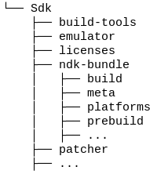
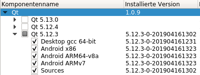
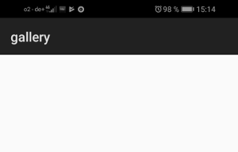

#Part IV - Deploment
##Deploying a dynamic app to Android

Now we are going to build an APK (**A**ndroid **P**ac**k**age).
Therefore we first have to install a few other components. 

##Install pyqtdeploy 2.4

pyqtdeploy is a tool made by the same company who also created PyQt5.   
You can install pyqtdeploy via pip.  

```console
user@machine:/path$ pip3 install pyqtdeploy
```

##Install Java JDK 8

You should be able to find all you need to install Java JDK 8 here: [https://docs.oracle.com/javase/8/docs/technotes/guides/install/install_overview.html](https://docs.oracle.com/javase/8/docs/technotes/guides/install/install_overview.html)

Just to mention I had problem to build the package with Java JDK 10 installed. 

##Install Android SDK

To install the Android SDK go to [https://developer.android.com/studio](https://developer.android.com/studio) scroll down to *Command line tools only* and download the file for your platform.   
Then unzip the file somewhere on your computer. 
After unzipping go to the Sdk/tools/bin directory and run the sdkmanager to install all necessary tools:

```console
user@machine:/path$ ./sdkmanager "platform-tools" "platforms;android-28"
```

##Install Android NDK

To install the Android NDK go to [https://developer.android.com/ndk/downloads](https://developer.android.com/ndk/downloads) scroll down to *Older Versions*, click the link *NDK Archives*, agree to the terms and download *Android NDK, Revision 19c* for your platform (Unfortuneatly version 20 is not working for us yet).   
After downloading unzip all the file into the SDK directory as *ndk-bundle*.
Your Android directory should look like the following:   


##Install Qt

Now we also need Qt. You can download it here: [https://www.qt.io/download](https://www.qt.io/download).
You should install the following components.   
   
You need Desktop to test your apps on the desktop.   
You need Android x86 to test yours apps on a simulator.   
You need Android ARM64 to test on a 64 bit device and   
you need Android ARMv7 to test on a 32 bit device.

##Download Source packages
The following packages should only be downloaded and not extracted.

- openssl-1.0.2s.tar.gz from [https://www.openssl.org/source/](https://www.openssl.org/source/)  
- PyQt3D_gpl-5.12.tar.gz from [https://www.riverbankcomputing.com/software/pyqt3d/download](https://www.riverbankcomputing.com/software/pyqt3d/download)  
- PyQt5_gpl-5.12.1.tar.gz from [https://www.riverbankcomputing.com/software/pyqt/download5](https://www.riverbankcomputing.com/software/pyqt/download5)  
- PyQtChart_gpl-5.12.tar.gz from [https://www.riverbankcomputing.com/software/pyqtchart/download](https://www.riverbankcomputing.com/software/pyqtchart/download)  
- PyQtDataVisualization_gpl-5.12.tar.gz from [https://www.riverbankcomputing.com/software/pyqtdatavisualization/download](https://www.riverbankcomputing.com/software/pyqtdatavisualization/download)  
- PyQtPurchasing_gpl-5.12.tar.gz from [https://www.riverbankcomputing.com/software/pyqtpurchasing/download](https://www.riverbankcomputing.com/software/pyqtpurchasing/download)  
- Python-3.7.2.tar.xz from [https://www.python.org/downloads/source/](https://www.python.org/downloads/source/)  
- QScintilla_gpl-2.11.1.tar.gz from [https://www.riverbankcomputing.com/software/qscintilla/download](https://www.riverbankcomputing.com/software/qscintilla/download)  
- qt-everywhere-src-5.12.2.tar.xz from [http://download.qt.io/official_releases/qt/5.12/5.12.2/single/qt-everywhere-src-5.12.2.tar.xz.mirrorlist](http://download.qt.io/official_releases/qt/5.12/5.12.2/single/qt-everywhere-src-5.12.2.tar.xz.mirrorlist)  
- sip-4.19.15.tar.gz from [https://www.riverbankcomputing.com/software/sip/download](https://www.riverbankcomputing.com/software/sip/download)  
- zlib-1.2.11.tar.gz from [https://zlib.net/](https://zlib.net/)  

##Create the build script

You should change the paths in the following script to your needs.  

*Deploy/build.sh*  
```bash
export ANDROID_NDK_ROOT=/media/art/data/Android/Sdk/ndk-bundle
export ANDROID_NDK_PLATFORM=android-28
export ANDROID_SDK_ROOT=/media/art/data/Android/Sdk
pyrcc5 main.qrc -o lib/main_rc.py
python3.7 build.py --target android-32 --installed-qt-dir /media/art/data/Qt/5.12.2 --no-sysroot --verbose --source-dir ./../../DeployAndroid/external-sources
```

external-sources points to the directory for the just downloaded packages.  
If you want to install the app to an Android device with 64 bit, then you should change the target to ```android-64
```.   
--installed-qt-dir points to the directory where Qt has been installed.


##Create the build.py script

The build.py I have got from here: [https://pypi.org/project/pyqtdeploy/#files](https://pypi.org/project/pyqtdeploy/#files) from the Demo project.
I have just added these lines of code: 

*Deploy/build.py* 
```python
...
run(['pyqtdeploy-build', '--target', target, '--sysroot', sysroot_dir, '--build-dir', build_dir, 'demo.pdy'])

# copy the main.qml to a directory where androiddeployqt will find it to add required libraries based on the import statements
cp = "cp " + os.path.join(dir_path, "view.qml") + " " + os.path.join(dir_path, build_dir)
run([cp])
# append the ANDROID_PACKAGE to the .pro file
with open(os.path.join(dir_path, build_dir, "main.pro"), "a") as fp:
    fp.write("\ncontains(ANDROID_TARGET_ARCH, armeabi-v7a) {\nANDROID_PACKAGE_SOURCE_DIR = " + os.path.join(dir_path, "android") + "\n}")

os.chdir(build_dir)
...
```

It is necessary that the androiddeployqt app will find a QML file in this directory. It scans all needed QML files for import statements to include the needed shared libraries into the APK.   
androiddeployqt will be called by pyqtdeploy.  

You can find the complete build.py and all other source files in the github repo: [https://github.com/Artanidos/DevAndroidPythonBook](https://github.com/Artanidos/DevAndroidPythonBook)  

With the ANDROID*PACKAGE*SOURCE_DIR we specify that we have got Android specific files like the *AndroidManifest.xml* and the icons in this specific folder.   
Also an app theme is included there. This theme only has one important thing *Theme.DeviceDefault.Light.NoActionBar*.
This is needed to make the splash screen look not so ugly.   
This is the default splash screen. With this little change the screen is just white.  



##Create the resource file

The resource file will contain our QML file as a python resource.   
To build the resource run the following.  

```console
user@machine:/path$ pyrcc5 main.qrc -o lib/main_rc.py
```

This is needed to find the QML later on the device. 
After these changes we have to change the main.py as follows:  

*Deploy/main.py*  
```python
import sys
import os
import lib.main_rc
from PyQt5.QtGui import QGuiApplication
from PyQt5.QtQml import QQmlApplicationEngine

if __name__ == "__main__":
    sys_argv = sys.argv
    sys_argv += ['--style', 'material']
    app = QGuiApplication(sys.argv)
    view =  "/storage/emulated/0/view.qml"
    if os.path.exists(view):
        # we are trying to load the view dynamically from the root of the storage
        engine = QQmlApplicationEngine(view)
        if not engine.rootObjects():
            sys.exit(-1)
    else:
        # if the attempt to load the local file fails, we load the fallback
        engine = QQmlApplicationEngine(":/view.qml")
        if not engine.rootObjects():
            sys.exit(-1)
    sys.exit(app.exec())
```
In this app we are looking for the file viem.qml, if it's stored on the mobile phone root.
This file we will produce later. It can be edited on the phone, so you don't have to recompile the whole app over and over.

With ```import lib.main_rc``` we add the resource file.   
And with the double point in **:**/view.qml we will tell Qt to load this file from a resource.

##Create a project file

The project file has the name demo.pdy and is needed for pyqtdeploy to be able to freeze all necessary packages.  

*Deploy/demo.pdy*
```xml
<?xml version='1.0' encoding='utf-8'?>
<Project usingdefaultlocations="1" version="7">
<Python major="3" minor="7" patch="2" platformpython="" />
<Application entrypoint="" isbundle="0" isconsole="0" ispyqt5="1" name="" script="main.py" syspath="">
<Package name="lib">
<PackageContent included="1" isdirectory="0" name="__init__.py" />
<PackageContent included="1" isdirectory="0" name="main_rc.py" />
<Exclude name="*.py" />
<Exclude name="*.qml" />
<Exclude name="*.sh" />
<Exclude name="*.pdy" />
<Exclude name="*.json" />
<Exclude name="*.qrc" />
<Exclude name="build-android-32" />
<Exclude name="sysroot-android-32" />
</Package>
</Application>
<PyQtModule name="QtWidgets" />
<PyQtModule name="QtNetwork" />
<PyQtModule name="QtAndroidExtras" />
<PyQtModule name="QtSvg" />
<PyQtModule name="QtQuick" />
<PyQtModule name="QtQml" />
<PyQtModule name="Qt" />
<PyQtModule name="QtQuickWidgets" />
<PyQtModule name="QtSensors" />
<PyQtModule name="QtBluetooth" />
<StdlibModule name="http.server" />
<StdlibModule name="http" />
<StdlibModule name="ssl" />
<StdlibModule name="sysconfig" />
<StdlibModule name="zlib" />
<StdlibModule name="importlib.resources" />
<StdlibModule name="os" />
<StdlibModule name="marshal" />
<StdlibModule name="imp" />
<StdlibModule name="logging" />
<StdlibModule name="logging.config" />
<StdlibModule name="logging.handlers" />
<StdlibModule name="contextlib" />
<StdlibModule name="urllib" />
<StdlibModule name="urllib.request" />
<StdlibModule name="traceback" />
<ExternalLib defines="" includepath="" libs="-lz" name="zlib" target="android" />
</Project>
```

One important thing here is the fact that we need a directory for all other python files to be included into the APK. We are using *lib* here.  Inside this directory should be an empty file named *\__init__.py*.     
Then all needed Qt packages are defined here. (We don't need all of them but maybe later).   
And also all needed standard python libraries are listed here.
This file can be produced using this command in the terminal:  

```console
user@machine:/path$ pyqtdeploy
```

##Create sysroot.json

This file hold all properties necessary to create a sysroot directory where some tools will be compiled. 

*Deploy/sysroot.json* 
```json
{
    "Description": "The sysroot for the DynPy application.",

    "android|macos|win#openssl": 
    {
        "android#source":   "openssl-1.0.2s.tar.gz",
        "macos|win#source": "openssl-1.1.0j.tar.gz",
        "win#no_asm":       true
    },

    "linux|macos|win#zlib": 
    {
        "source":               "zlib-1.2.11.tar.gz",
        "static_msvc_runtime":  true
    },

    "qt5": 
    {
        "android-32#qt_dir":        "android_armv7",
        "android-64#qt_dir":        "android_arm64_v8a",

        "linux|macos|win#source":   "qt-everywhere-src-5.12.2.tar.xz",
        "edition":                  "opensource",

        "android|linux#ssl":        "openssl-runtime",
        "ios#ssl":                  "securetransport",
        "macos|win#ssl":            "openssl-linked",

        "configure_options":        [
                "-opengl", "desktop", "-no-dbus", "-qt-pcre"
        ],
        "skip":                     [
                "qtactiveqt", "qtconnectivity", "qtdoc", "qtgamepad",
                "qtlocation", "qtmultimedia", "qtnetworkauth",
                "qtremoteobjects",
                "qtscript", "qtscxml", "qtserialbus",
                "qtserialport", "qtspeech", "qttools",
                "qttranslations", "qtwayland", "qtwebchannel", "qtwebengine",
                "qtwebsockets", "qtwebview", "qtxmlpatterns"
        ],

        "static_msvc_runtime":      true
    },

    "python": 
    {
        "build_host_from_source":   false,
        "build_target_from_source": true,
        "source":                   "Python-3.7.2.tar.xz"
    },

    "sip": 
    {
        "module_name":  "PyQt5.sip",
        "source":       "sip-4.19.15.tar.gz"
    },

    "pyqt5": 
    {
        "android#disabled_features":    [
                "PyQt_Desktop_OpenGL", "PyQt_Printer", "PyQt_PrintDialog",
                "PyQt_PrintPreviewDialog", "PyQt_PrintPreviewWidget"
        ],
        "android#modules":              [
                "QtQuick", "QtCore", "QtGui", "QtNetwork", "QtPrintSupport", "QtWidgets",
                "QtAndroidExtras", "QtQuickWidgets", "QtSvg", "QtBluetooth", "QtNetwork", "QtSensors", 
                "QtQml"
        ],

        "source":                       "PyQt5_*-5.12.1.tar.gz"
    }
}
```

##Build the APK

If all went well we are now able to build the APK and deploy it to a device.
Therefore we run ```./build.sh``` in the terminal. Make sure that *build.sh* is executable.
This first will create a sysroot directory with tools and libraries. If you are going to build the APK a second time you can skip building the sysroot with this option in the *build.sh*: 

```
--no-sysroot
```

##Install APK to device

When you have successfully build the APK you are now able to install it to your device.   
First of all make sure the developer-mode is switched on on your device. If not you have to switch it on first.   
Open your device settings app. Look for "About you phone" and search for the "Build Number". Then you have to tap on it seven times.   
You should get a message that the developer options are now turned on. 
Connect your device to your computer using a USB cable.   
Now open the developer option in the settings app and look for USB-Configuration. Normally it is set to "Just load". Change it now to media transfer protocol (MTP).   
Then look for USB-Debugging and switch it to on.   
This done you are now able to find your device with the adb command:  

```console
user@machine:/path$ adb devices
List of devices attached
* daemon not running; starting now at tcp:5037
* daemon started successfully
5WH6R19329010194    device
```

If your device is listed copy the string to the left and paste it into the terminal:  

```console
user@machine:/path$ adb -s 5WH6R19329010194 install /home/art/Sourcecode/Python/Book/Deploy/build-android-32/dynpy/build/outputs/apk/debug/dynpy-debug.apk
```

Also copy the APK path which will be displayed after the build process has finished.

I have put the whole command into the *deploy.sh* file to use it later.

Now you can try to start the app. It should show up with the text DynPy in the middle.  
Now you open the settings app on your phone and enable the storage for DynPy.  
Then the app can open file here: */storage/emulated/0*, which emulates the root on the phone.  
Now we are creating a new file with the name *view.qml* in this directory on your phone and restart the app.  
```qml
import QtQuick 2.5
import QtQuick.Controls 2.0

ApplicationWindow 
{
    visible: true

    Text 
    {
        anchors.centerIn: parent
        text: "DynPy"
    }
}
```
If everything went well, the app shall now display "DynPy".  

This was you are able to develop the app further directly on the phone, without the need to recompile everything.  

##Summary
Hopefully we have deployed the DynPy app to our device. 
To find out how to build and deploy to Android took me several days.   
If you are running into trouble here don't hesitate to contact me.   
Maybe I can help you out and publish our experience into the next version of this book so that other people are not running into trouble.
